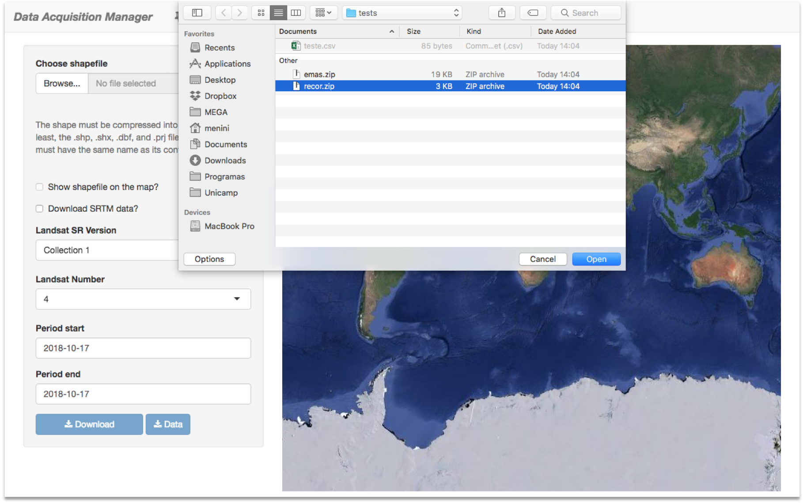

*This tutorial comprehends the Data Acquisition Manager v0.0.1. Notice that if you are using a newer version, some features might be different.*

***

## Description

**Data Acquisition Manager (DAM)** is a [Shiny](https://shiny.rstudio.com/) app, developed using R and Python, designed for the download of *Landsat Surface Reflectance* time series pixel or image data or.

If you encounter any bugs, please send a message to nathmenini@gmail.com, or create an issue on the [GitHub page](https://github.com/nathmenini/download-rsd/).

## Tutorial

Albeit very simple, please follow these screen captures bellow to learn how to
properly use the tool.

### Pixel Tab <i class="fa fa-thumb-tack"></i>

### Raster Tab <i class="fa fa-image"></i>

